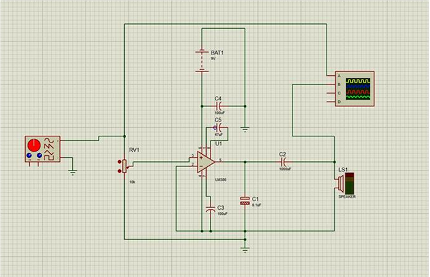
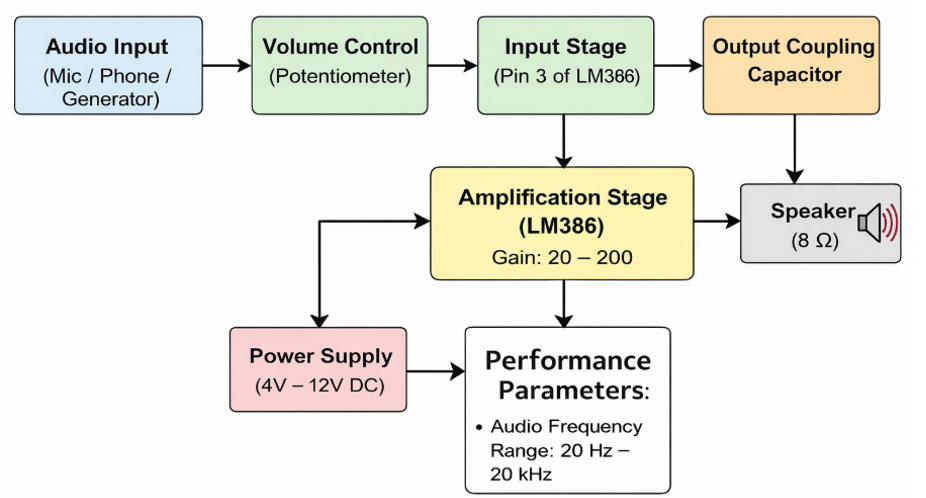
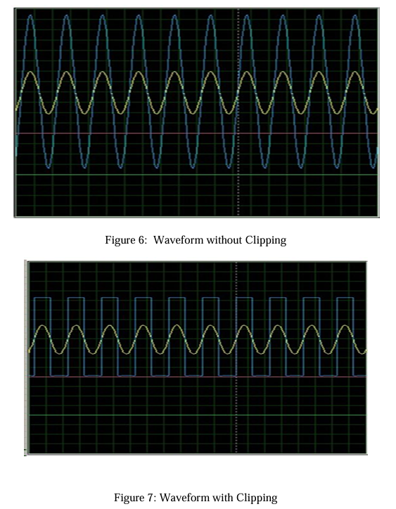

# LM386-Audio-Amplifier

## Introduction
* Audio signals from sources like microphones or mobile devices are often too weak to drive speakers directly.
* Amplifiers are required to increase the signal strength without distorting the original sound.
* This project focuses on designing a **low-power audio amplifier using the LM386 IC**, suitable for portable and battery-operated applications.
* The LM386 is widely used due to its simplicity, low cost, and minimal external components.

---

## Overview
* The project implements a compact and efficient **audio amplification system**.
* It amplifies weak input signals into audible output for speakers.
* The system is designed to operate at low voltage (4V–12V).
* It is suitable for:
  * Portable audio devices
  * Small speakers
  * Intercom systems
  * Educational experiments

---

## History / Background
* Audio amplification circuits have evolved from bulky transistor-based designs to compact IC-based systems.
* The LM386 was introduced as a **low-voltage audio power amplifier IC** for consumer applications.
* It became popular due to:
  * Internal gain control
  * Low power consumption
  * Ease of implementation
* Today, it is widely used in embedded and portable audio systems.

---
## Stimulation

  

## Methodology / Steps of Project

### Step 1: Input Stage
* Audio signal is given as input.
* A potentiometer (VR1) is used to control volume.

### Step 2: Amplification Stage
* LM386 IC amplifies the input signal.
* Gain is adjusted using a capacitor between pins 1 and 8.

### Step 3: Output Stage
* Output signal passes through a coupling capacitor.
* Drives an 8Ω speaker safely.

### Step 4: Noise Reduction
* Zobel network (resistor + capacitor) improves stability.
* Bypass capacitor reduces noise.

---

## Block Diagram

  

---

## Results

  

### Observations
* Clear audio amplification achieved
* Minimal distortion in output
* Stable operation with few components
* Suitable for low-power applications
  
### Waveforms

### Performance
* Input Signal: 10 mV – 200 mV
* Supply Voltage: 4V – 12V
* Gain: 20 to 200 (adjustable)
* Output Power: Up to 1W
* Frequency Range: 20 Hz – 20 kHz

---

## Sample Calculation

Given:
* Vpp = 7.2 V
* Load Resistance = 8Ω

### Step 1: Peak Voltage
Vp = Vpp / 2

### Step 2: RMS Voltage
Vrms = Vp / √2

### Step 3: Output Power
P = (Vrms²) / R

---

## Conclusion
* The LM386 amplifier circuit successfully amplifies weak audio signals.
* It is simple, cost-effective, and efficient.
* The design is compact and suitable for real-world portable applications.
* The project demonstrates practical implementation of analog electronics concepts.

---

## Future Scope
* Integration with Bluetooth or wireless modules
* Use in hearing aid devices
* Mini speaker system development
* PCB design for compact size
* Adding tone control circuits (bass/treble)

---

